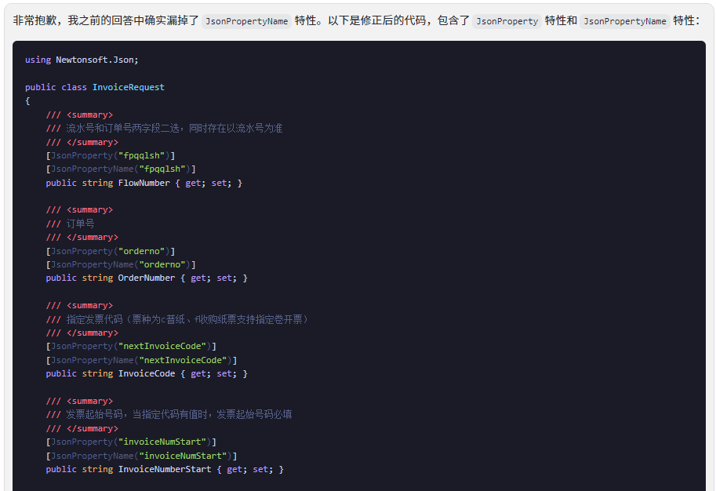

# NuoNuoSdk [](https://www.nuget.org/packages/NuoNuoOpenSdk/)[](https://www.nuget.org/packages/NuoNuoOpenSdk/)

[诺诺开放平台](https://open.jss.com.cn/)SDK

优点是相较于官方其他语言的SDK优点是使用了模型参数,开箱即用

## 安装

```
dotnet add package NuoNuoOpenSdk
```

## 使用示例

``` csharp

//添加诺诺开放平台SDK
builder.Services.AddNuoNuoSdk(builder.Configuration, "NuoNuo");

//获取token,根据token有效期自行维护缓存
var token = await _nuoNuoSdk.GetMerchantToken();

 //查询余票
var stockRes = await _nuoNuoSdk.ExecuteAsync<GetInvoiceStockRequest, GetInvoiceStockResponse>(new GetInvoiceStockRequest
{
    AccessToken = token.AccessToken
});
//使用默认接口实现
var stockRes2 = await _nuoNuoSdk.GetInvoiceStockAsync(new GetInvoiceStockRequest
{
    AccessToken = token.AccessToken
});

```
具体参数使用方法请参考诺诺官方文档,如果缺少对应的参数模型欢迎自行实现然后PR

### 参数模型生成小技巧

使用ChatGpt帮我们完成

1. 使用咒语


2. 得到结果


3. 纠正结果


